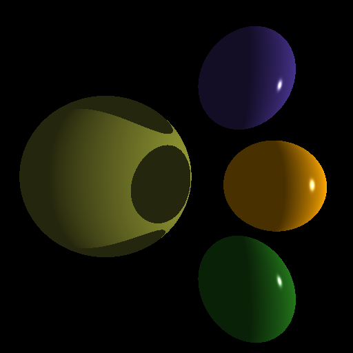
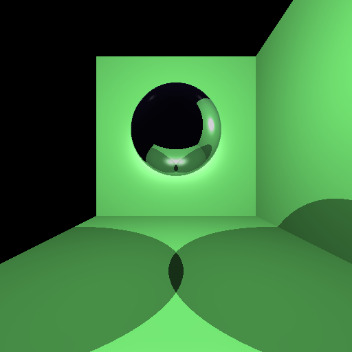
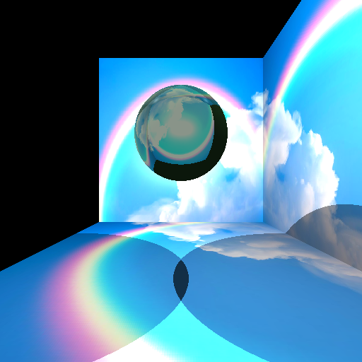
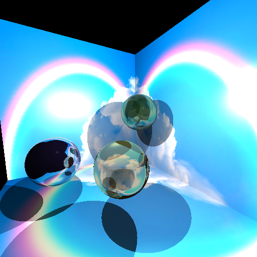
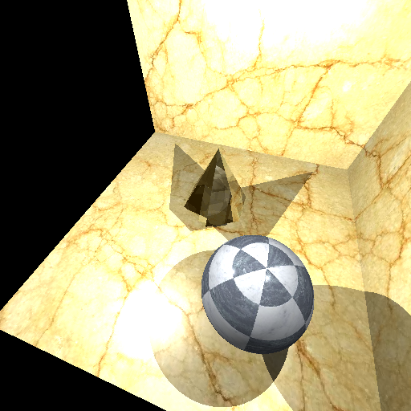

# Ray Tracer

This is RayTracer project done for University Vienna course "Foundation of Computer Graphics".
The main idea was to parse XML, which contained the information about the picture and then cast rays to detect objects and save it to PNG file.

# Build
How to build that:
    - be in the main directory,
    - mkdir build
    - cd build
    - cmake ..\CMakeLists.txt  
    - cmake --build . --target ALL_BUILD  --config Release
on Windows the program is in build/Debug/ray_tracer.exe // on linux in the main directory

# Execution
How to execute:
ray_tracer -filename e.g .\ray_tracer.exe example1.xml
If executed without arguments nothing will happen.
The outfiles are saved in the directory where executable file is.

# Requirments
C ++ 17 is  required to run this program. My building environment was: 

Edition	Windows 10 Education N
Version	22H2
Installed on	‎02/‎09/‎2021
OS build	19045.2965
Experience	Windows Feature Experience Pack 1000.19041.1000.0

# Samples

# TO DO
Object transformations correction (there are mistakes)